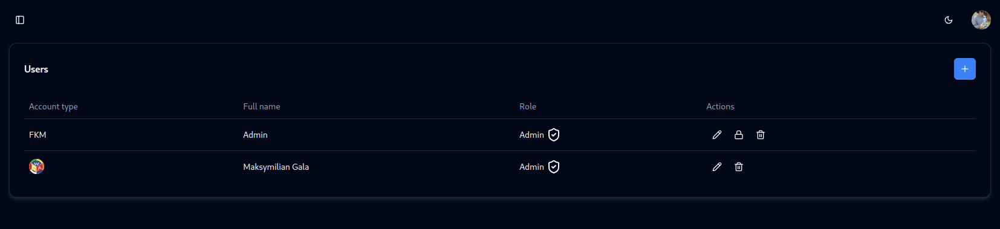

# Accounts

FKMTime primarily uses WCA accounts for authentication. This means, delegates and organizers should log in with their WCA accounts and they will have admin access to the panel. 

But sometimes, you want for example staff member to check-in competitors. You have to create an FKMTime account for them.

## Creating an account

Go to **accounts** page

Click on the plus button, fill in the form and click create button. Staff member can now log in with these credentials.

You can also delete any account, edit details or change password.

## Access to competition

If someone who logs in with WCA account doesn't have access to the competition will obviously not be added to accounts page, you have to add them as delegate/organizer on the WCA website and sync WCIF in competition tab.
