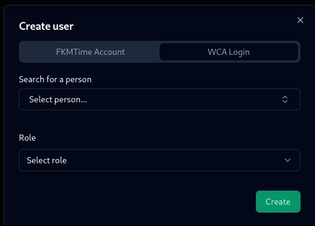

# Accounts

FKMTime primarily uses WCA accounts for authentication. This means, delegates and organizers should log in with their WCA accounts and they will have admin access to the panel. 

But sometimes, you want for example Competition Volunteer to check-in competitors. You have to create an FKMTime account for them OR add their WCA Account to the system.

## Creating an account

Go to **users** page

Click on the plus button and choose between FKM and WCA account.

### FKM Account

Just fill in the details and click save, user will be able to login with username and password you provided.

### WCA Account

Search for a person, select role and click save. User will be able to login with WCA account and will have the same permissions as you selected.

You can also delete any account, edit details or change password.

## Access to competition

If someone who logs in with WCA account doesn't have access to the competition will obviously not be added to accounts page, you have to add them as delegate/organizer on the WCA website and sync WCIF in competition tab first (or add their WCA Account, as described above).
