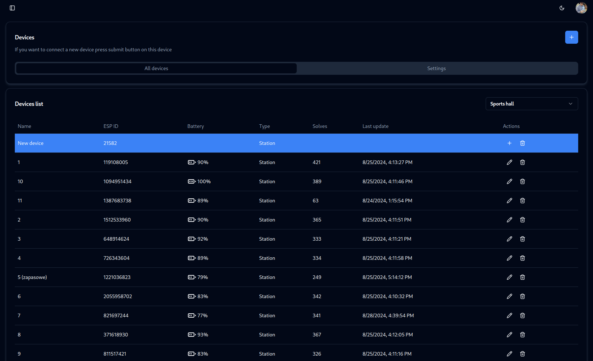

# Adding devices to database

You have to enter your WiFi network details in devices settings on frontend. Micro-connector will connect via bluetooth with all devices and send them WiFi details. After that, devices will be able to communicate with backend by WiFi through micro-connector. You can read more about this in the [production](/production/setup-for-production.md) section.

## Enter your Wi-Fi data

Go to devices tab in frontend and click on the settings icon and enter your Wi-Fi data. 

## Adding devices

### If your machine supports bluetooth

After turning on backend and micro-connector it will automatically write Wi-Fi data to devices via bluetooth. After that, devices will be able to communicate with backend by WiFi through micro-connector.

### If your machine doesn't support bluetooth

You have to connect to the hotspot created by device. Name of the hotspot will be `FkmTimer-XXXX` and password will be `FkmTimer`. After connecting go to `192.168.4.1` and manually enter your wifi data.

### After entering Wi-Fi data

Click the submit button, and you can easily add devices to the database. They will be displayed at the top of the table.

