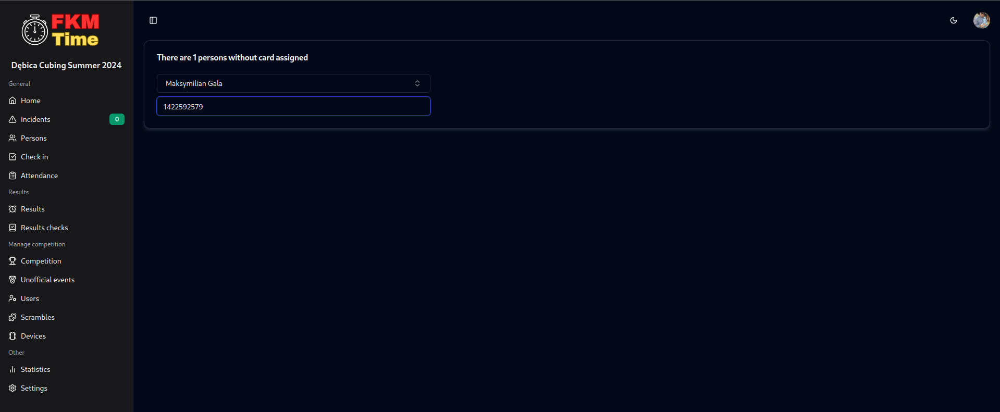

# Assigning cards

## Buy proper cards

You will need to buy RFID cards with 13.56 MHz frequency.

## Assign cards to the competitors

Go to the persons tab and click Assign cards button. 

Just search the competitor and scan the card you want to assign to them and click enter. Search the next competitor and repeat the process.

## Adding volunteers to the system

You can click on the plus button in the persons tab and fill in the form. After that, you can assign a card to them as well.