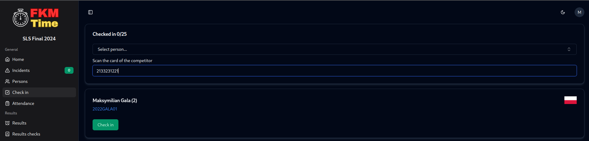
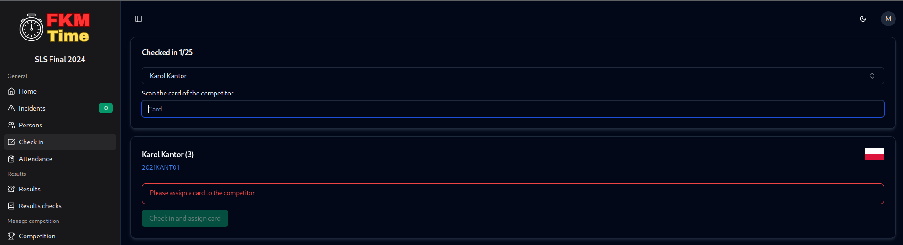
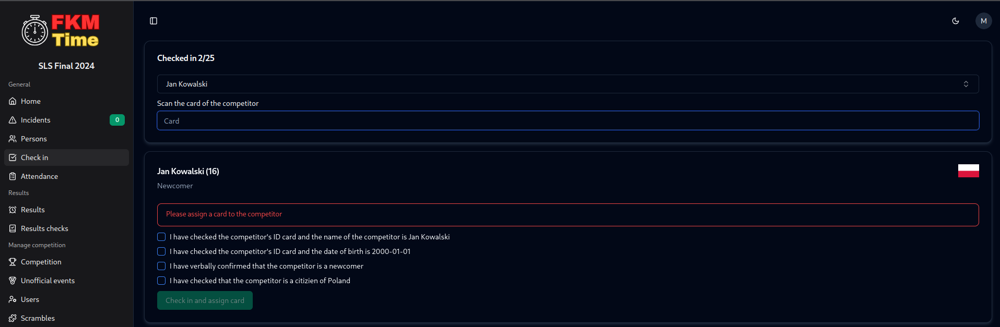

# Assigning cards & check-in

## Assigning cards

### Buy proper cards

You will need to buy RFID cards with 13.56 MHz frequency.

### Assign cards to the competitors

Go to the persons tab and click Assign cards button. 

Just search the competitor and scan the card you want to assign to them and click enter. Search the next competitor and repeat the process.

## Check-in

FKMTime has a check-in system that allows you to keep track of who is present at the competition and got their ID (or any other things).

To start, go to the check-in page.

### Cards assigned before the competition

If you assigned cards to the competitors before the competition, you can just scan the card and check-in the competitor.

### Cards not assigned before the competition

If you didn't assign cards to the competitors before the competition, you can search for the competitor, assign card to them and check-in at the same time.

### Newcomers

If you are checking-in the newcomer you have to check if their data matches the data presented on their document (passport, driver's license, etc.).

