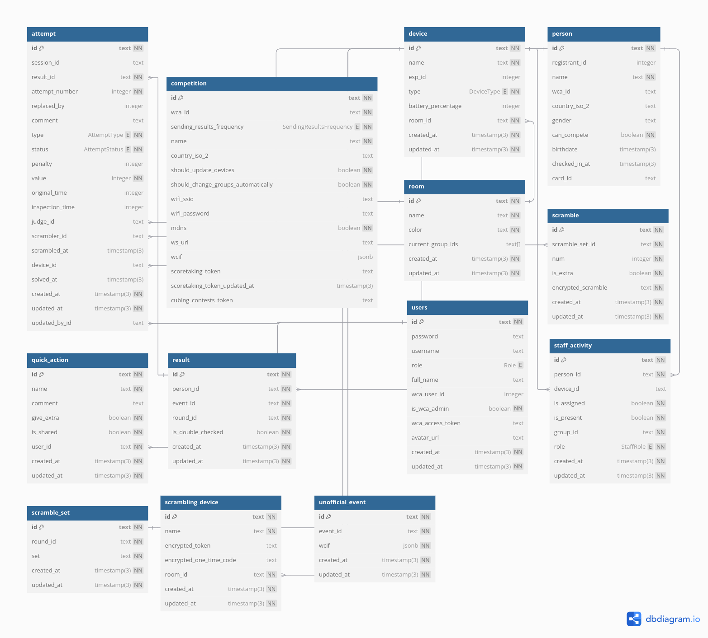

# Database structure

FKMTime uses PostgreSQL database to store all the data. The database structure is shown below.

:::note
We use Prisma ORM to interact with the database. You can read more about Prisma [here](https://www.prisma.io/).
::: 

:::info
We are using camelCase in our code, although the database is using snake_case. Prisma is taking care of the conversion using `@map`.
:::

:::info
We are using UUIDs as primary keys for all tables.
:::

## Tables

### Competition

There is one record in this table. It stores the competition settings, WCIF and other general data. Most of the data in this table is inserted during the import from the WCA website.

- `id` - unique identifier
- `name` - competition name
- `wcaId` - WCA competition ID
- `sendingResultsFrequency` - enum, stores how often the results are sent to the WCA Live/CubingContests
- `countryIso2` - country ISO2 code
- `shouldUpdateDevices` - boolean, if the devices should be updated with new releases
- `shouldChangeGroupsAutomatically` - boolean, if the groups should be changed automatically
- `wifiSsid` - wifi SSID, that FKMTime devices will be using to connect to micro-connector
- `wifiPassword` - wifi password
- `mdns` - boolean, whether mDNS should be used to discover devices
- `ws_url` - websocket URL if mDNS is not used
- `wcif` - JSON, stores public WCIF of the competition
- `scoretakingToken` - token taken from WCA Live for entering results
- `cubingContestToken` - token taken from CubingContests for entering results
- `scoretakingTokenExpiresAt` - date, after this date token may have expired (7 days after saving the new token)

### UnofficialEvent

This table stores unofficial events that are held during the competition. 

- `id` - unique identifier
- `eventId` - id taken from `backend/src/events.ts`
- `wcif` - event data in WCIF format (stored as JSON)
- `createdAt` - date of creation
- `updatedAt` - date of last update

### Room

This table stores rooms taken from WCIF during import.

- `id` - unique identifier
- `name` - room name
- `color` - room color
- `currentGroupIds` - array of WCIF group IDs that are currently taking place in the room, may be empty
- `createdAt` - date of creation
- `updatedAt` - date of last update

### Device

This table stores data about all FKMTime devices that are connected to the system. 

- `id` - unique identifier
- `name` - device name, can be changed
- `espId` - ESP32 device ID
- `type` - device type (enum)
- `batteryPercentage` - battery percentage, updated automatically
- `roomId` - [Room](#room)
- `createdAt` - date of creation
- `updatedAt` - date of last update

### User 

All user accounts are stored in this table, both FKMTime and WCA accounts added to the system.

- `id` - unique identifier
- `password` - hashed password, only available for FKMTime accounts
- `username` - username, only available for FKMTime accounts
- `role` - user role (enum)
- `fullName` - full name of the user
- `wcaUserId` - WCA user ID, only available for WCA accounts
- `isWcaAdmin` - boolean, if the user is WCA admin, only available for WCA accounts
- `wcaAccessToken` - WCA access token, only available for WCA accounts
- `createdAt` - date of creation
- `updatedAt` - date of last update

### QuickAction

This table stores quick actions that can be used to simplify resolving incidents process by delegats.

- `id` - unique identifier
- `name` - action name
- `comment` - comment that will be added to the attempt
- `giveExtra` - boolean, if the action should give extra attempt
- `isShared` - boolean, if the action is shared between all users
- `userId` - [User](#user) that created the action
- `createdAt` - date of creation
- `updatedAt` - date of last update

### Person

This table stores data about competitors and staff members. Most data are inserted during import and sync.

- `id` - unique identifier
- `registrantId` - WCA registrant ID
- `name` - full name
- `wcaId` - WCA ID
- `countryIso2` - country ISO2 code
- `gender` - gender
- `canCompete` - boolean, if the person can compete
- `birthdate` - date of birth, null for all persons except newcomers
- `checkedInAt` - date of check-in
- `cardId` - assigned card ID

### StaffActivity

This table stores data about all staff/competing activities, pre-assigned and performed during the competition.

- `id` - unique identifier
- `personId` - [Person](#person)
- `deviceId` - [Device](#device) (can be null)
- `isAssigned` - boolean, if the activity is pre-assigned
- `isPresent` - boolean, if the person performed the activity
- `groupId` - WCIF group ID
- `role` - role of the person in the group (enum)
- `createdAt` - date of creation
- `updatedAt` - date of last update

### Result

This table stores all results that are entered during the competition.

- `id` - unique identifier
- `personId` - [Person](#Person)
- `eventId` - event ID, taken from `backend/src/events.ts`
- `roundId` - round ID in WCIF format
- `isDoubleChecked` - boolean, if the result was already double-checked
- `createdAt` - date of creation
- `updatedAt` - date of last update

### Attempt

This table is the biggest table, it stores all attempts that are entered during the competition.

- `id` - unique identifier
- `sessionId` - unique identifier generated by FKMTime deice that prevents from entering the same attempt twice
- `resultId` - [Result](#result)
- `attemptNumber` - number of the attempt
- `replacedBy` - id of the attempt that replaced this one (if extra attempt was granted)
- `comment` - comment for the attempt, added by the delegate
- `type` - [AttemptType](#attempttype), see below
- `status` - [AttemptStatus](#attemptstatus), see below
- `value` - time in centiseconds
- `originalTime` - exact time taken from stackmat, in miliseconds
- `judgeId` - [Person](#person) that judged the attempt
- `deviceId` - [Device](#device) that was used to enter the attempt (can be null if attempt was entered manually)
- `solvedAt` - date of finishing the solve
- `createdAt` - date of creation
- `updatedAt` - date of last update

### ScramblingDevice

This table stores data about scrambling devices (e. g. laptops) that are used during the competition.

- `id` - unique identifier
- `name` - device name
- `encryptedToken` - token used to authenticate the device
- `encryptedOneTimeCode` - one-time code used to login on the device
- `roomId` - [Room](#room)
- `createdAt` - date of creation
- `updatedAt` - date of last update

### ScrambleSet

- `id` - unique identifier
- `roundId` - round ID in WCIF format
- `set` - letter, e. g. "A"
- `createdAt` - date of creation
- `updatedAt` - date of last update

### Scramble

- `id` - unique identifier
- `scrambleSetId` - [ScrambleSet](#scrambleset)
- `num` - number of the scramble in the set
- `isExtra` - boolean, if the scramble is extra
- `encryptedScramble` - encrypted scramble
- `createdAt` - date of creation
- `updatedAt` - date of last update

## Enums 

### AttemptType
- `STANDARD_ATTEMPT` - applied for all normal attempts
- `EXTRA_ATTEMPT` - applied for extra attempts

### AttemptStatus
- `STANDARD` - applied for all normal attempts
- `UNRESOLVED` - applied for incidents that need to be resolved
- `RESOLVED` - applied for resolved incidents, without extra
- `EXTRA_GIVEN` - applied for resolved incidents, with extra

### UserRole
- `ADMIN` - user with all permissions
- `STAFF` - user with permissions to check-in, assigning cards and viewing the results

### DeviceType
- `STATION` - device that is used to enter results  
- `ATTENDANCE_SCRAMBLER` - staff attendance device for scramblers
- `ATTENDANCE_RUNNER` - staff attendance device for runners

### StaffRole
- `COMPETITOR` - competitor
- `JUDGE` - judge
- `RUNNER` - runner
- `SCRAMBLER` - scrambler

### SendingResultsFrequency
- `AFTER_SOLVE` - selected by default, results are sent to WCA Live/Cubing contestsafter each solve
- `EVERY_5_MINUTES` - results are sent to WCA Live/Cubing Contests every 5 minutes
- `NEVER` - results are not sent to WCA Live/Cubing Contests