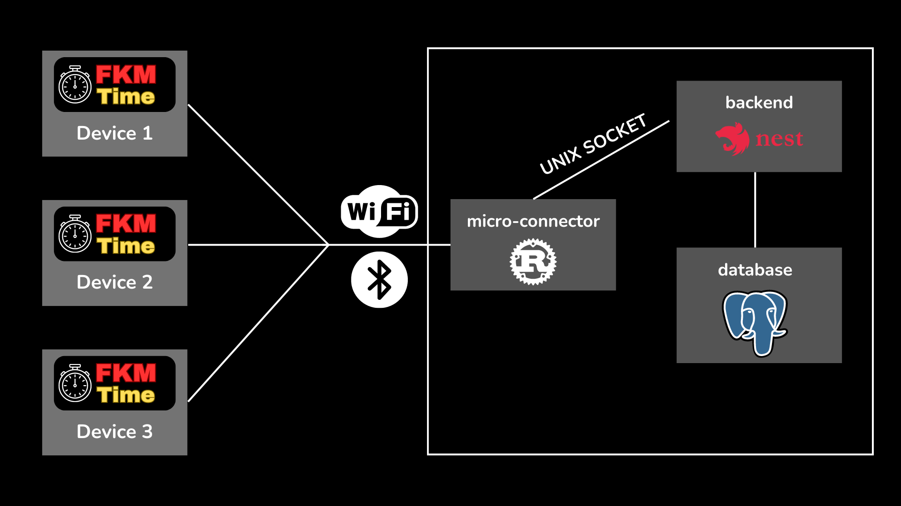

# How FKMTime works?

Basically, there are:
- Backend: Nest.js
- Frontend: React
- Database: PostgreSQL
- Micro-connector: Rust
- FKM Devices (PlatformIO)

Communication between devices and backend looks like this:

