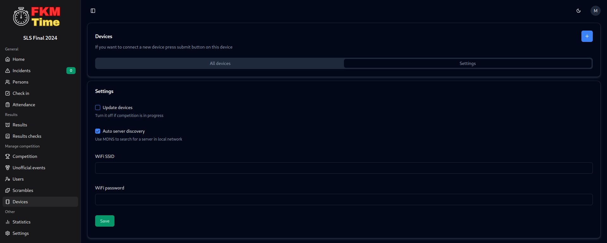

# How updates work?

We use [GitHub Releases](https://github.com/FKMTime/firmware/releases) to distribute updates. 

You have to turn on updates in device settings in frontend. After that, turn on all devices and micro-connector. Micro-connector checks for new updates every 5 minutes and if there is a new update, it will automatically download it and send it to all devices.

:::warning
Do not turn off device while updating!
:::