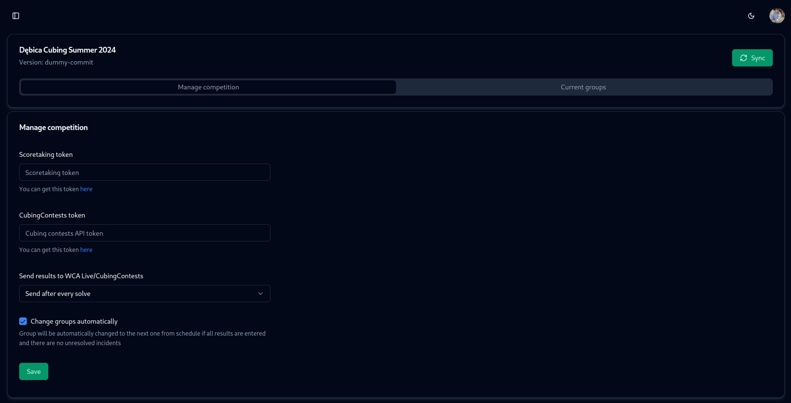

# Importing competition

:::important
It is recommended to import competition after creating groups.
:::

To import a competition, you need WCA account with access to the competition you want to import.

After first login to the system, you will be redirected to the import page.

Just click the green import button and you will be redirected to competition settings page.

You will need a scoretaking token that can be taken from WCA Live. Go to the [account](https://live.worldcubeassociation.org/account) and generate one. This token is valid for 7 days and specific to the selected competition. 

Also, you can set how often you want to send results to WCA Live. By default, every attempt is sent immediately after scanning cards. But you can turn it off completely (for testing purposes) or send results every 5 minutes if internet connection in the venue is not stable.

Paste the token to the input field and click the save button. 

