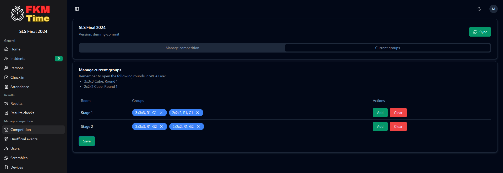

# Selecting current event

FKMTime needs to know which group is currently taking place in each room in order to enter results to the correct round.

## Best option
You can opt for doing it automatically, by checking the "Change groups automatically" checkbox in the competition settings, if so Group will be automatically changed to the next one from schedule if all results are entered and there are no unresolved incidents.

## Changing groups manually
Although it is recommended to select "Change groups automatically" option you are not forced to do so, you can change groups manually (but remember to do that after every group).

Go to the rooms tab and select the group that will take place now in each room.

After selecting, don't forget to click the save button and open this round in WCA Live.

