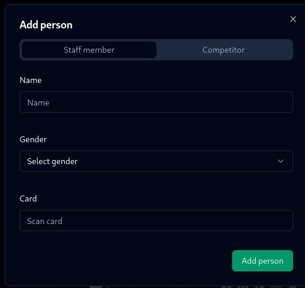
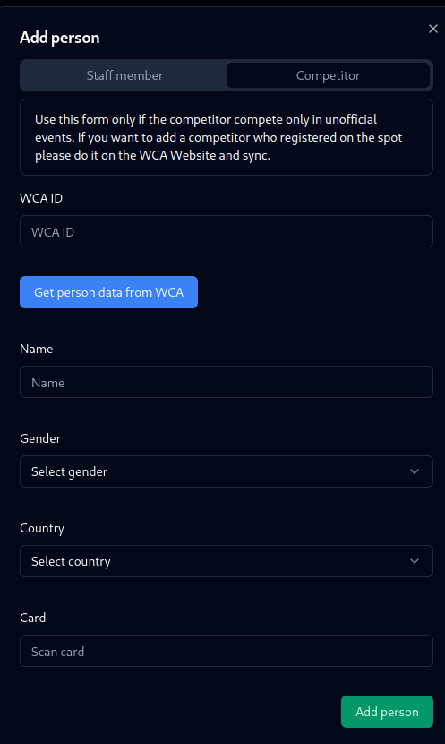

# Staff members

Go to the persons page and click on the plus button.

## Adding staff member to the system

Fill in the form and click save. You can also assign a card to them (read more about assignig cards [here](/basic-knowledge/assigning-cards)).

## Adding a competitor competing only in unofficial events to the system

If you want to add a competitor who is competing only in unofficial events, you can do it by clicking on the plus button in the persons tab and fill in the form. After that, you can assign a card to them as well.

