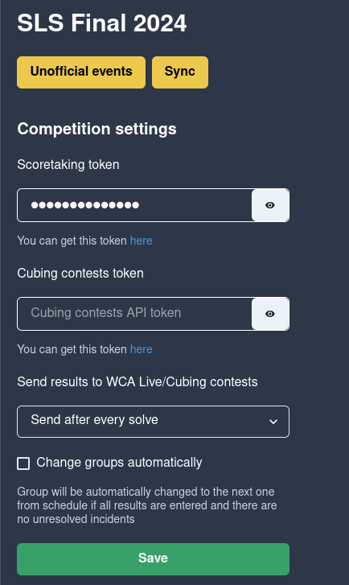
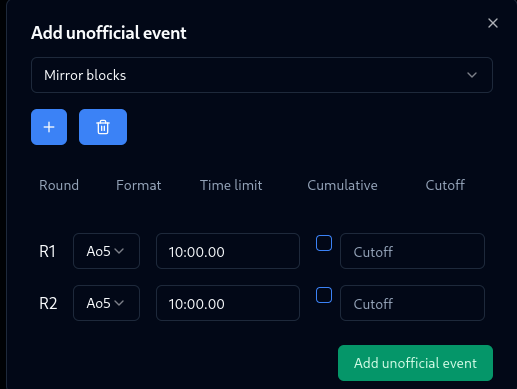

# Unofficial events

It is possible to use FKMTime for unofficial events. Basically, all you need to do is creating unofficial event, set up rounds and limits and the rest is the same as for official events.

## How to add an unofficial event?

1. Go to Competition tab and click "Unofficial events" button.

2. Click on the plus button and choose the event and adjust rounds and limits.

Then click on "Add" button.

3. That's it! Now everything works the same as for official events.

## Entering unofficial events results into CubingContests

If you want to enter unofficial events results into CubingContests, you need to enter CubingContests API key in competition settings.

